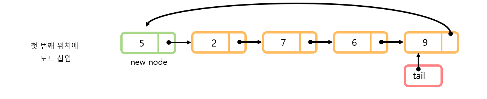
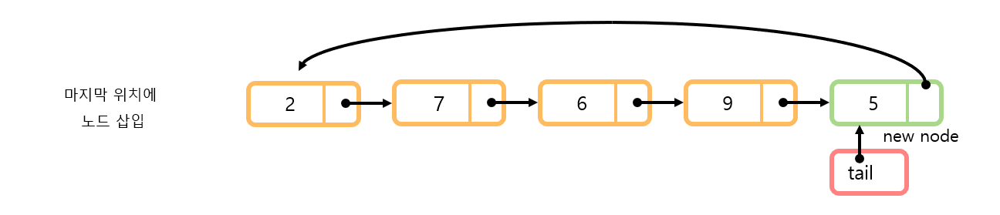

# Circular Linked List
##  📝목차
- [원형 연결 리스트의 이해](https://github.com/choisb/Study-DataStructure/tree/master/03_CircularLinkedList#-원형-연결-리스트의-이해)
- [원형 연결 리스트의 구현](https://github.com/choisb/Study-DataStructure/tree/master/03_CircularLinkedList#-원형-연결-리스트의-구현)
___
## ✔ 원형 연결 리스트의 이해
##### 원형 연결 리스트란
- 단순연결 리스트는 마지막 노드가 `NULL`을 가리킴.

- 마지막 노드가 첫 번째 노드를 가리키면 원형 연결 리스트.


##### 변형 원형 연결 리스트
- 일반적으로 원형 연결 리스트는 데이터 삽입 삭제의 효율성을 위해서 `head`가 아닌 `tail`을 사용한다. 
  - `head`를 사용할때
    - 첫 번째 위치에 노드 삽입: n회 탐색 -> **O(n)**
    - 마지막 위치에 노드 삽입: n회 탐색 -> **O(n)**


  - `tail`을 사용할 때
    - 첫 번째 위치에 노드 삽입: 1회 탐색 -> **O(1)**
    - 마지막 위치에 노드 삽입: 2회 탐색 -> **O(1)**


[(위로)](https://github.com/choisb/Study-DataStructure/tree/master/03_LinkedList#Circular-Linked-List) / [(처음으로)](https://github.com/choisb/Study-DataStructure/blob/master/README.md#data-structure)

___
## ✔ 원형 연결 리스트의 구현
- 원형 연결 리스트 구현의 상세 내용에 대해서는 소스코드의 주석으로 대체.
  - [`CLinkedList` 소스](https://github.com/choisb/Study-DataStructure/tree/master/03_CircularLinkedList/CLinkedList)
- 아래에는 단순 연결 리스트의 ADT와 구현과정에 등장하는 몇 가지 주요 아이디어만 서술.
 
##### 원형 연결 리스트의 ADT

- 앞서 다룬 단순 연결 리스트와 상당히 유사한 ADT를 가졌고 차이는 아래와 같다.
  - 구현의 편의성을 위해서 정렬기능은 빠졌다.
  - LNext 함수가 무한 반복 호출 가능하며, 리스트의 끝에 도달할 경우 첫 노드부터 다시 조회한다.
> 원형 연결 리스트의 ADT
```c
void ListInit(List * plist);
// 초기화할 리스트의 주소 값을 인자로 전달한다.
// 리스트 생성 후 제일 먼저 호출되어야 하는 함수이다.

void LInsert(List * plist, LData data);
// 리스트의 끝에 데이터를 저장한다. 매개변수 data에 전달된 값을 저장한다.
// 리스트의 끝에 데이터를 저장하는 것은 리스트의 시작점에 데이터를 저장한 후 
    // tail을 next방향으로 한칸 옮긴것과 결겨과 동일한다.

void LInsertFront(List * plist, LData data);
// 리스트의 시작점에 데이터를 저장한다. 매개변수 data에 전달된 값을 저장한다.

int LFirst(List * plist, LData * pdata);
// 첫 번째 데이터가 pdata가 가리키는 메모리에 저장된다.
// 데이터의 참조를 위한 초기화가 진행된다.
// 참조 성공 시 TRUE(1), 실패시 FALSE(0)반환

int LNext(List * plist, LData * pdata);
// 참조된 데이터의 다음 데이터가 pdata가 가리키는 메모리에 저장된다.
// 순차적인 참조를 위해서 무한히 반복 호출이 가능하다.
// 참조를 새로 시작하려면 먼저 LFirst 함수를 호출해야 한다.
// 리스트의 끝에 도달할 경우 첫 노드부터 다시 조회한다.
// 참조 성공 시 TRUE(1), 실패 시 FALSE(0) 반환

LData LRemove(List * pdata);
// LFirst 또는 LNext 함수의 마지막 반환 데이터를 삭제한다.
// 삭제된 데이터는 반환된다.
// 마지막 반환 데이터를 삭제하므로 연이은 반복 호출을 허용하지 않는다.

int LCount(List * plist);
// 리스트에 저장되어 있는 데이터의 수를 반환한다.

```

##### 노드의 삽입
- 원형 연결 리스트의 시작부분에 새로운 노드를 삽입하는 것은 직관적으로 간단하다.
  - `tail`의 `next`가 노드의 시작이기 때문이다.
    ```c
    newNode->next = plist->tail->next;
    plist->tail->next = newNode;
    ``` 


- 리스트의 마지막에 새로운 노드 `5`를 넣는 것은 직관적으로 간단하지는 않다.
  - 새로운 노드를 삽입하기 전까지는 `tail`은 노드 `9`를 가리키고 있기 때문이다.



- 리스트 마지막에 노드를 삽입하기 위해서는
  - 리스트의 앞쪽에 노드를 삽입 후
  - `tail`을 순 방향으로 한칸 앞을 가리키게 한다.
  - 결과적으로 `tail`이 새로운 노드 `5`를 가리키게 되면서 마지막 위치에 노드가 삽입된 것과 동일해진돠.

```c
void LInsert(List * plist, LData data) // 꼬리에 노드 추가
{
    // 꼬리에 노드 추가하는 것은 결국 머리에 노드를 추가한 것에 
    //tail이 가리키는 노드를 한칸 옆으로 이동한 결과와 동일하다.
    LInsertFront(plist, data);
    plist->tail = plist->tail->next;    
}
```
[(위로)](https://github.com/choisb/Study-DataStructure/tree/master/03_LinkedList#Circular-Linked-List) / [(처음으로)](https://github.com/choisb/Study-DataStructure/blob/master/README.md#data-structure)
