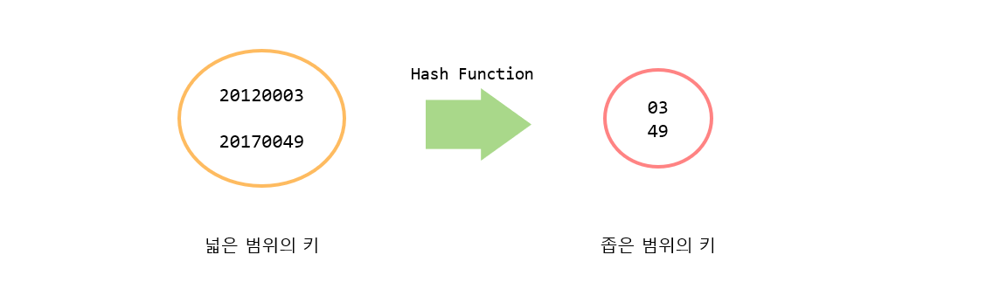
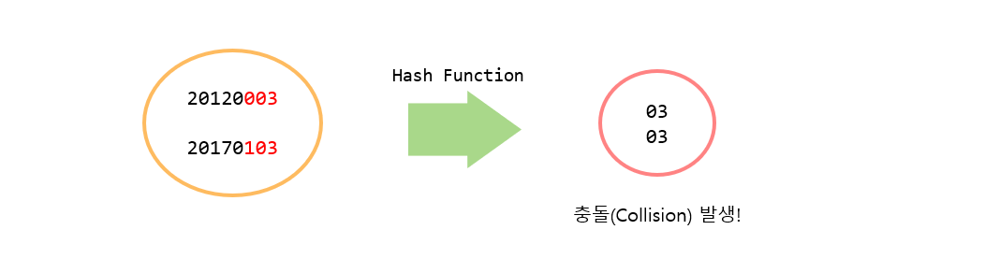
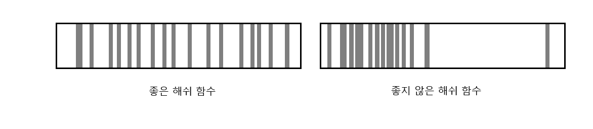
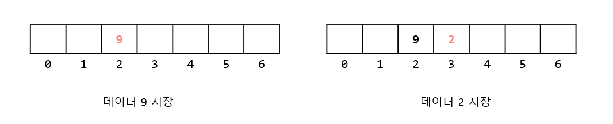

# Table & Hash
## 📝 목차
- [테이블(Table)자료구조의 이해](https://github.com/choisb/Study-DataStructure/tree/master/11_Table_Hash#-%ED%85%8C%EC%9D%B4%EB%B8%94table%EC%9E%90%EB%A3%8C%EA%B5%AC%EC%A1%B0%EC%9D%98-%EC%9D%B4%ED%95%B4)
- [해쉬 함수와 충돌](https://github.com/choisb/Study-DataStructure/tree/master/11_Table_Hash#-%ED%95%B4%EC%89%AC-%ED%95%A8%EC%88%98%EC%99%80-%EC%B6%A9%EB%8F%8C)
- [충돌(Collision) 문제의 해결책](https://github.com/choisb/Study-DataStructure/tree/master/11_Table_Hash#-%EC%B6%A9%EB%8F%8Ccollision-%EB%AC%B8%EC%A0%9C%EC%9D%98-%ED%95%B4%EA%B2%B0%EC%B1%85)
___

## ✔ 테이블(Table)자료구조의 이해
##### 📍 테이블이란
- key, value 쌍으로 이루어진 자료구조로 key를 통해서 원하는 value에 바로 접근 할 수 있다.
- 즉, 탐색에 있어서 O(1)의 시간 복잡도를 가진다.
- 테이블에서는 key가 존재하지 않는 value는 저장할 수 없고, 모든 key는 중복되지 않아야 한다.

- 아래와 같은 배열도 간단한 테이블의 예시가 될 수 있다.
```c
typedef struct _empInfo
{
    int empNum; // 직원의 고유 번호
    int age;    // 직원의 나이
}

// 직원의 정보를 담고 있는 테이블
int main()
{
    EmpInfo empInfoArr[1000];
    EmpInfo ei;

    scanf("%d %d", &(ei.empNum), &(ei.age));
    // 고유번호를 key로 value에 해당하는 직원 정보에 바로 접근
    empInfoArr[ei.empNum] = ei; 

    return 0;
}
```
- 이렇게 간단한 배열이지만, 직원의 고유 번호를 인덱스 값으로 하여, 그 위치에 데이터를 저장 혹은 탐색할 수 있다.
- 하지만 직원 고유 번호의 범위가 10,000,000~99,999,999 라면, 불필요하게 큰 배열을 사용해야 하는 문제가 발생한다.

___
## ✔ 해쉬 함수와 충돌
##### 📍 해쉬 함수와 충돌

- 앞서 다룬 배열구조의 테이블은 다음 두가지 문제를 가진다.
  - 직원의 고유번호의 범위가 배열의 인덱스 값으로 사용하기에 적당하지 않다.
  - 직원의 고유번호의 범위를 수용할 수 있는 불필요하게 큰 배열이 필요하다.

- 해쉬 함수는 이러한 문제를 해소 할 수 있다. 다음은 간단한 해쉬함수의 예시이다.
```c
int GetHashValue(int empNum)
{
    return empNum % 100;
}
```



- 위에 나온 간단한 해쉬함수는 다음과 같은 이점을 얻을 수 있다.
  - 직원의 고유번호 8자리를 단 2자리로 줄이면서 key의 범위를 8자리 수에서 2자리 수로 줄일 수 있게 되었다.
  - 이를 통해서 99,999,999개의 불필요한 배열 대신에 99개의 배열로 문제를 해결할 수 있게 되었다.

- 이 해쉬 함수는 100명이 넘지 않는 회사에서 충분히 유용하게 사용될 수 있을 것이다.
- 하지만 직원의 수가 100명이 넘어가면 비둘기집의 원리에 의해서 반드시 해시값의 중복이 발생할 수 있고, 이를 **충돌**이라고 한다.
- 물론 직원의 수가 100명이 넘지 않더라도 충돌은 발생할 수 있다.
  > 직원의 고유번호가 **20120013** / **20140013** 인 경우가 존재한다면 충돌이 발생한다.




##### 📍 해쉬 함수의 구현
- 해쉬 함수 구현: [HashTable 소스](https://github.com/choisb/Study-DataStructure/tree/master/11_Table_Hash/HashTable)

##### 📍 좋은 해쉬 함수의 조건

- 좋은 해쉬 함수의 조건을 살펴보기 전에 좋은 해쉬 함수를 사용한 결과와 좋지 못한 해쉬 함수의 사용 결과를 비교해 보자.
  - 데이터가 골고루 분포되었다는 말은 충돌이 발생할 가능성이 낮다는 뜻이 되기도 한다.
  - 반대로 데이터가 특정지역에 밀집되었다는 말은 충돌이 발생할 가능성이 그만큼 높다는 뜻이다.
  


- 좋은 해쉬 함수를 디자인 할 수 있는 방법은 다양하지만, 일반적으로는 키의 일부분을 참조해서 해쉬값을 만들지 않고, 키 전체를 참조하여 해쉬값을 만든다.
  - 키의 일부분을 조합하여 해쉬 값을 생성하는 것 보다 많은 수의 데이터를 조합하여 해쉬 값을 생성했을 때, 보다 다양한 값의 생성을 기대할 수 있기 때문.
___
## ✔ 충돌(Collision) 문제의 해결책
- 충돌이 발생하면, 충돌이 발생한 그 자리를 대신해서 빈 자리를 찾아야 한다. 
- 다만 빈 자리를 찾는 방법에 따라서 해결책이 구분된다.

##### 📍 선형 조사법(Linear Probing)과 이차 조사법(Quadratic Probing)
- 충돌이 발생했을 때 그 옆자리가 비었는지 살펴보고, 비었을 경우 그 자리에 대신 저장하는 방법.
  - 예를 들어 해쉬 함수가 다음과 같을 때 그림과 같이 데이터가 저장된다.
    > 해쉬 함수:  key % 7  
    

- 선형 조사법은 충돌의 횟수가 증가함에 따라서 클러스터 현상(특정 영역에 데이터가 집중적으로 몰리는 현상)이 발생한다는 단점이 있다.
    
- 이 문제를 해결하기 위해서 바로 옆자리가 아니라 조금더 먼 자리를 탐색하는 방법을 **이차 조사법**(Quadratic Probing)이라 한다.
- 이차 조사법은 n^2칸 옆의 슬롯을 검사한다.

##### 📍 이중 해쉬(Double Hash)
- 이차 조사법은 선형 조사법의 문제점을 어느 정도 해결하였지만, 그래도 다음과 같은 문제가 남았다.
    > 해쉬 값이 같으면, 충돌 발생시 빈 슬롯을 찾기 위해서 접근하는 위치가 늘 동일하다.
    - 이런 문제 때문에 여전히 클러스터가 발생할 확률이 높다.

- 이런 문제의 원인은 충돌이 발생했을 때 항상 **규칙적인 방법**으로 빈 슬롯을 조사했기 때문이다.
- 이중 해쉬는 충돌이 발생했을 빈 슬롯을 **불규칙적으로 조사하기** 위해 다시 해쉬함수를 사용하는 방법이다.
  - 1차 해쉬 함수: 키를 근거로 저장위치를 결정하기 위한 해쉬 함수
  - 2차 해쉬 함수: 충돌 발생시 몇 칸 뒤를 살필지 결정하기 위한 해쉬 함수
- 예를 들어 다음과 같이 이중 해쉬함수를 구성할 수 있을 것이다.
    > 1차 해쉬 함수: k % 15  
    > 2차 해쉬 함수: 1 + k % c
  - 2차 해쉬 함수에 1을 붙이는 이유는, 2차 해쉬 값은 충돌이 발생한 지점으로 부터 몇칸 뒤를 살필지 결정하게 된다. 
  그렇기 때문에 2차 해쉬 값이 0이 나오는 것을 방지하기 위함이다.
  - c는 보통 15보다 작은 소수(Prime Number)를 사용한다. 굳이 소수를 사용하는 이유는 소수를 사용했을 때 클러스터 현상의
  발생 확률을 현저히 낮춘다는 통계에 근거한다.
- 실제로 이중 해쉬는 이상적인 충돌 해결책으로 알려져 있다.

##### 📍 체이닝(Chaining)
- 앞서 나온 충돌 해결방법들은 충돌이 발생하면 **다른 자리에 대신 저장**하는 방법들이다. 
이를 **열린 어드레싱 방법**(open addressing method)이라고 한다

- 체이닝은 충돌이 발생하더라도 **자신의 자리에 저장**하는 방법으로 **닫힌 어드레싱 방법**(close addressing method)이라고 한다.

- 체이닝은 슬롯을 연결 리스트로 구성하여 충돌이 발생하면 해당 자리에 슬롯을 새로 연결해나가는 방식으로 문제를 해결한다.

##### 📍 체이닝 구현
- 체이닝 구현: [Chaining 소스](https://github.com/choisb/Study-DataStructure/tree/master/11_Table_Hash/Chaining)
