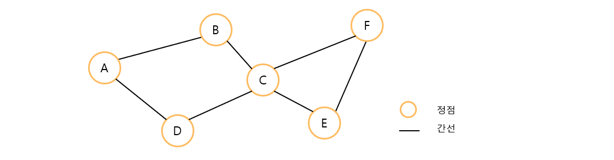
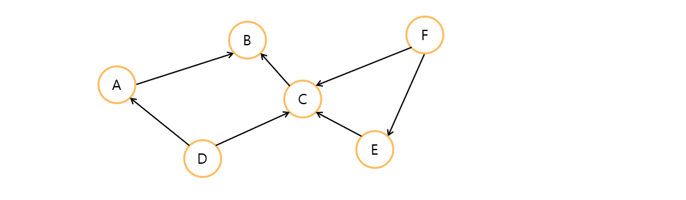
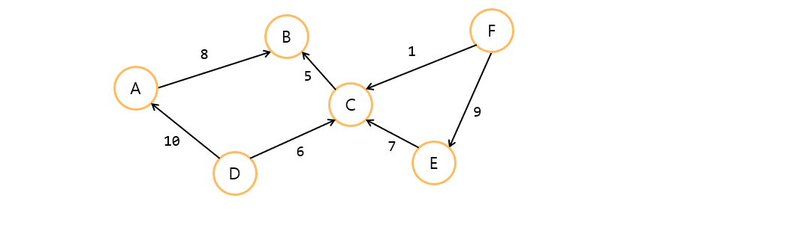
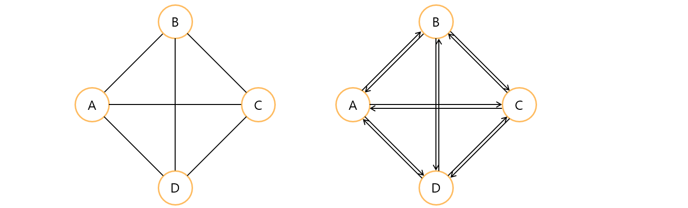
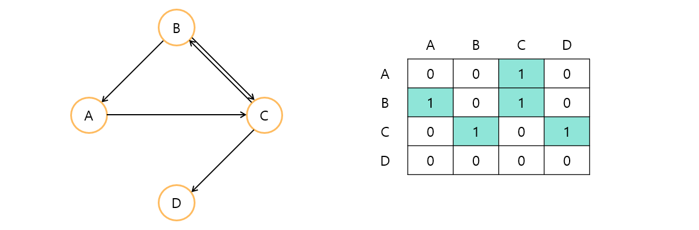
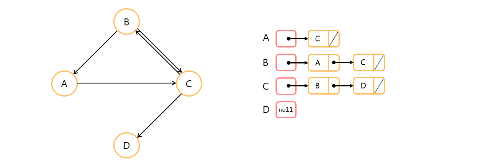

# Graph
## 📝 목차
- [그래프의 이해와 종류](https://github.com/choisb/Study-DataStructure/tree/master/11_Table_Hash#-%ED%85%8C%EC%9D%B4%EB%B8%94table%EC%9E%90%EB%A3%8C%EA%B5%AC%EC%A1%B0%EC%9D%98-%EC%9D%B4%ED%95%B4)
- [해쉬 함수와 충돌](https://github.com/choisb/Study-DataStructure/tree/master/11_Table_Hash#-%ED%95%B4%EC%89%AC-%ED%95%A8%EC%88%98%EC%99%80-%EC%B6%A9%EB%8F%8C)
- [충돌(Collision) 문제의 해결책](https://github.com/choisb/Study-DataStructure/tree/master/11_Table_Hash#-%EC%B6%A9%EB%8F%8Ccollision-%EB%AC%B8%EC%A0%9C%EC%9D%98-%ED%95%B4%EA%B2%B0%EC%B1%85)
___

## ✔ 그래프의 이해와 종류
##### 📍 그래프의 이해와 종류
- 그래프는 **정점**(vertex)과 **간선**(edge)으로 이루어져 있는 자료구조이다.

- 각각의 간선들은 양방향, 혹은 단방향의 **방향성**을 가질 수 있다.
  - 방향성이 없는 그래프를 **무방향 그래프**(undirected graph)라 하고
  - 방향성이 있는 그래프를 **방향 그래프**(directed graph) 또는 **다이그래프**(digraph)라 한다.

- 각각의 간선들은 가중치(weight)를 가질 수 있다.

- 각각의 정점들이 간선으로 모두 연결되어 있다면 **완전 그래프**(complete graph)라 한다.
  - 정점의 수가 동일하다면 방향 그래프가 무방향 그래프 보다 간선의 수가 2배 더 많다.


___
## ✔ 그래프의 구현
##### 📍 그래프 자료구조의 ADT
- 자료구조 학습에 있어서 필요한 만큼 최소한의 그래프 자료구조의 ADT를 정의한다. 
```c
// 그래프의 초기화를 진행한다.
// 두 번째 인자로 정점의 수를 전달한다.
void GraphInit(UALGraph * pg, int nv);

// 그래프 초기화 과정에서 할당한 리소스를 반환한다.
void GraphDestroy(UALGraph * pg);

// 매개변수 fromV와 toV로 전달된 정점을 연결하는 간선을 그래프에 추가한다.
void AddEdge(UALGraph * pg, int fromV, int toV);

// 그래프의 간선정보를 출력한다.
void ShowGraphEdgeInfo(UALGraph * pg);
```

- 여기서 정의한 ADT의 주요특징은 다음과 같다.
  - 그래프의 초기화 과정에서 정점의 수를 결정하도록 정의
  - 간선을 추가는 하되 삭제는 불가능하도록 정의

##### 📍 그래프를 구현하는 두가지 방법
- 그래프를 구현하는 방법도 배열을 이용하는 방법과 연결 리스트를 이용하는 방법으로 나뉜다.
  - 인접 행렬(adjacent matrix) 기반 그래프: 정방 행렬을 사용
  - 인접 리스트(adjacent list) 기반 그래프: 연결 리스트를 활용

- 정방 행렬을 사용한 그래프 표현

- 연결 리스트를 사용한 그래프 표현

