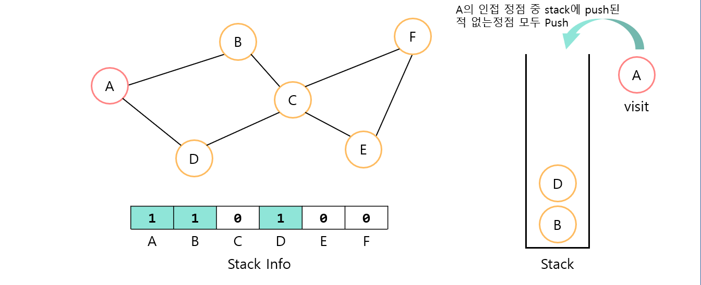

# Graph
## 📝 목차
- [그래프의 이해와 종류](https://github.com/choisb/Study-DataStructure/tree/master/11_Table_Hash#-%ED%85%8C%EC%9D%B4%EB%B8%94table%EC%9E%90%EB%A3%8C%EA%B5%AC%EC%A1%B0%EC%9D%98-%EC%9D%B4%ED%95%B4)
- [해쉬 함수와 충돌](https://github.com/choisb/Study-DataStructure/tree/master/11_Table_Hash#-%ED%95%B4%EC%89%AC-%ED%95%A8%EC%88%98%EC%99%80-%EC%B6%A9%EB%8F%8C)
- [충돌(Collision) 문제의 해결책](https://github.com/choisb/Study-DataStructure/tree/master/11_Table_Hash#-%EC%B6%A9%EB%8F%8Ccollision-%EB%AC%B8%EC%A0%9C%EC%9D%98-%ED%95%B4%EA%B2%B0%EC%B1%85)
___

## ✔ 그래프의 이해와 종류
##### 📍 그래프의 이해와 종류
- 그래프는 **정점**(vertex)과 **간선**(edge)으로 이루어져 있는 자료구조이다.

- 각각의 간선들은 양방향, 혹은 단방향의 **방향성**을 가질 수 있다.
  - 방향성이 없는 그래프를 **무방향 그래프**(undirected graph)라 하고
  - 방향성이 있는 그래프를 **방향 그래프**(directed graph) 또는 **다이그래프**(digraph)라 한다.

- 각각의 간선들은 가중치(weight)를 가질 수 있다.

- 각각의 정점들이 간선으로 모두 연결되어 있다면 **완전 그래프**(complete graph)라 한다.
  - 정점의 수가 동일하다면 방향 그래프가 무방향 그래프 보다 간선의 수가 2배 더 많다.


___
## ✔ 그래프의 구현
##### 📍 그래프 자료구조의 ADT
- 자료구조 학습에 있어서 필요한 만큼 최소한의 그래프 자료구조의 ADT를 정의한다. 
```c
// 그래프의 초기화를 진행한다.
// 두 번째 인자로 정점의 수를 전달한다.
void GraphInit(UALGraph * pg, int nv);

// 그래프 초기화 과정에서 할당한 리소스를 반환한다.
void GraphDestroy(UALGraph * pg);

// 매개변수 fromV와 toV로 전달된 정점을 연결하는 간선을 그래프에 추가한다.
void AddEdge(UALGraph * pg, int fromV, int toV);

// 그래프의 간선정보를 출력한다.
void ShowGraphEdgeInfo(UALGraph * pg);
```

- 여기서 정의한 ADT의 주요특징은 다음과 같다.
  - 그래프의 초기화 과정에서 정점의 수를 결정하도록 정의
  - 간선을 추가는 하되 삭제는 불가능하도록 정의

##### 📍 그래프를 구현하는 두가지 방법
- 그래프를 구현하는 방법도 배열을 이용하는 방법과 연결 리스트를 이용하는 방법으로 나뉜다.
  - 인접 행렬(adjacent matrix) 기반 그래프: 정방 행렬을 사용
  - 인접 리스트(adjacent list) 기반 그래프: 연결 리스트를 활용

- 정방 행렬을 사용한 그래프 표현

- 연결 리스트를 사용한 그래프 표현


- 연결 리스트를 사용한 그래프 구현 구현: [ALGraph 소스](https://github.com/choisb/Study-DataStructure/tree/master/12_Graph/ALGraph)

___
## ✔ 그래프의 탐색 - DFS
- 그래프에는 이진 탐색 트리와 같이 노드가 규칙적으로 저장되어 있지 않다. 
그렇다고 연결 리스트 처럼 모든 정점들이 순차적으로 연결되어 있지도 않다.

- 때문에 그래프에서 탐색을 하기 위해서는 모든 정점을 방문할 수 있어야 하고, 이를 위한 별도의 알고리즘이 필요하다. 
여기서는 그래프의 탐색을 위한 대표적인 알고리즘 두 가지를 다룬다.
  - 깊이 우선 탐색: **Depth First Search** (**DFS**)
  - 너비 우선 탐색: **Breadth First Search** (**BFS**)  

##### 📍 깊이 우선 탐색: DFS
- 깊이 우선 탐색 (DFS)란 특정 노드에서 시작해 다음 분기로 넘어가기 전에 해당 분기를 완벽하게 탐색하는 방법이다.
- DFS를 탐색하기 위해서는 **Stack**이필요하다. (BFS와 가장 큰 차이점)
- DFS의 탐색 순서는 다음과 같다.

>1. 첫 시작 **정점**을 **Stack**에 **Push** 한다.  
>2. **Sack**에서 **정점**을 **Pop** 하여 그 정점을 **방문**한다.  
>3. 방문한 정점의 **인접한 정점**중 **Stack**에 **Push**된 적 없는 정점을 **Push**한다  
>4. **Stack**이 비어있지 않다면 2.부터 다시 반복한다.

##### 📍 DFS의 이해
- DFS를 그림으로 표현하면 다음과 같다

1. 그래프와 함께 스택 하나와, Stack에 Push된 기록을 관리할 배열 하나를 선언한다.

2. 시작지점 A를 Stack에 Push하고 A가 Stack에 들어갔음을 표시한다. 

3. Stack에서 A를 Pop하고 A를 방문한다.

4. A의 인접한 정점 중 Stack에 Push된 적 없는 정점(B,D)을 Push한다. 

5. Stack이 비어있지 않기 때문에 Stack에서 Pop하고 Pop된 정점 D를 방문한다.

6. D의 인접한 정점 중 Stack에 Push된 적 없는 정점(C)를 Push 한다. (A는 Push된 적 있기 때문에 무시)

7. Stack이 비어있지 않기 때문에 Stack에서 Pop하고 Pop된 정점 C를 방문한다.

8. C의 인접한 정점 중 Stack에 Push된 적 없는 정점(E,F)를 Push한다. (B는 Push된 적 있기 때문에 무시)

9. Stack이 비어있지 않기 때문에 Stack에서 Pop하고 Pop된 정점 F를 방문한다.
 더 이상 Push할 수 있는 정점은 존재하지 않기 때문에 Push는 하지 않는다. 

10. Stack이 비어있지 않기 때문에 Stack에서 Pop하고 Pop된 정점 E를 방문한다.

11. Stack이 비어있지 않기 때문에 Stack에서 Pop하고 Pop된 정점 E를 방문한다.

12. Stack이 비었기 때문에 탐색을 종료한다. 

##### 📍 DFS의 구현
- 소스코드로 나타내면 다음과 같다.
```c
void DFShowGraphVertex(ALGraph * pg, int startV)
{
    Stack stack;
    int visitV;
    int nextV;

    StackInit(&stack);			// DFS를 위한 스택의 초기화
    SPush(&stack, startV);		// 시작점을 스택에 push
    MarkVertex(pg, startV);

    do
    {
        // 스택의 첫번째 정점을 pop하고 방문할 정점으로 저장
        visitV = SPop(&stack);
        VisitVertex(visitV);	// 정점 방문
	
        // 현재 방문한 정점의 인접 정점 중 스택에 들어간 적 없는 정점들 모두 Push 
        if (LFirst(&(pg->adjList[visitV]), &nextV) == TRUE)
        {
            do
            {
                // 스택에 Push된 적 없는 정점이라면 스택에 Push
                if (IsPushedVertex(pg, nextV) == FALSE) {
                SPush(&stack, nextV);
                MarkVertex(pg, nextV);
                }
            } while (LNext(&(pg->adjList[visitV]), &nextV) == TRUE);
        }
		
    } while (!SIsEmpty(&stack)); // 스택이 비어질때 까지 반복


    // 이후의 탐색을 위해서 탐색 정보 초기화
    memset(pg->stackInfo, 0, sizeof(int) * pg->numV);
}
```
> 출력 결과
```
A와 연결된 정점: B D
B와 연결된 정점: A C
C와 연결된 정점: B D E F
D와 연결된 정점: A C
E와 연결된 정점: C F
F와 연결된 정점: C E
A D C F E B
```
- 전체 구현 코드 확인하기: [DFS 소스](https://github.com/choisb/Study-DataStructure/tree/master/12_Graph/DFS2)
  - DFS의 구현에는 앞서 구현한 ArrayBaseStack와 DLinkedList가 사용되었다. 

___
## ✔ 그래프의 탐색 - BFS
##### 📍 너비 우선 탐색: BFS
- 너비 우선 탐색(BFS)란 시작 정점을 방문한 후 시작 정점에 인접한 모든 정점들을 우선 방문하는 방법이다.
- BFS를 구현하기 위해서는 **Queue**가 필요하다. (DFS와의 가장 큰 차이점)
  - DFS에서 Stack을 사용했던 부분을 Queue로 바꾸면 BFS로 동작한다.
- BFS의 탐색 순서는 다음과 같다.